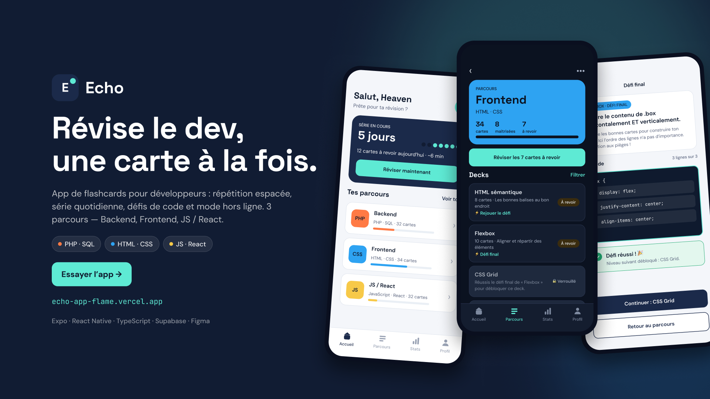

<div align="center">

# Echo

**Révise le dev, une carte à la fois.**

Application de flashcards pour réviser le développement web : PHP, SQL, HTML, CSS, JavaScript et React.

[**Tester l'app →**](https://echo-app-flame.vercel.app)



</div>

---

## Le principe

- **3 parcours** : Backend (PHP, SQL), Frontend (HTML, CSS) et JS / React
- **Des niveaux** dans chaque parcours. Pour passer au suivant, il faut réussir un petit quiz
- **Tu avances à ton rythme**, sur les 3 parcours en même temps
- **Des cartes à retourner** : une question au recto, la réponse avec un exemple de code au verso

## Avec ou sans compte

| | Sans compte | Avec compte |
|---|---|---|
| Tester toutes les cartes | ✅ | ✅ |
| Progression sauvegardée | ❌ | ✅ |
| Série de jours | ❌ | ✅ |

## Stack technique

| | |
|---|---|
| **Design** | Figma (zoning, wireframes, design system) |
| **Front** | React Native, Expo, TypeScript |
| **Backend** | Supabase (authentification et base de données) |
| **Déploiement** | PWA exportée avec Expo, hébergée sur Vercel |

### Pourquoi une PWA ?

Le projet a été pensé comme une app mobile. Publier une app native sur les stores demande des comptes développeur payants et une validation. Echo est donc exportée pour le web et déployée en PWA : le même code, accessible depuis n'importe quel navigateur et installable sur le téléphone comme une vraie app.

## Lancer le projet en local

```bash
git clone https://github.com/HEAVENGHOBRIAL/echo-app.git
cd echo-app
npm install
```

Créer un fichier `.env.local` à la racine avec les clés Supabase :

```
EXPO_PUBLIC_SUPABASE_URL=...
EXPO_PUBLIC_SUPABASE_KEY=...
```

Puis lancer :

```bash
npx expo start
```

## La suite

Echo est en **V1**. Prochaines étapes : plus de langages et de nouveaux niveaux.

---

<div align="center">

Conçu et développé par **Heaven Ghobrial**, étudiante en BUT MMI à l'IUT du Puy-en-Velay.

</div>
